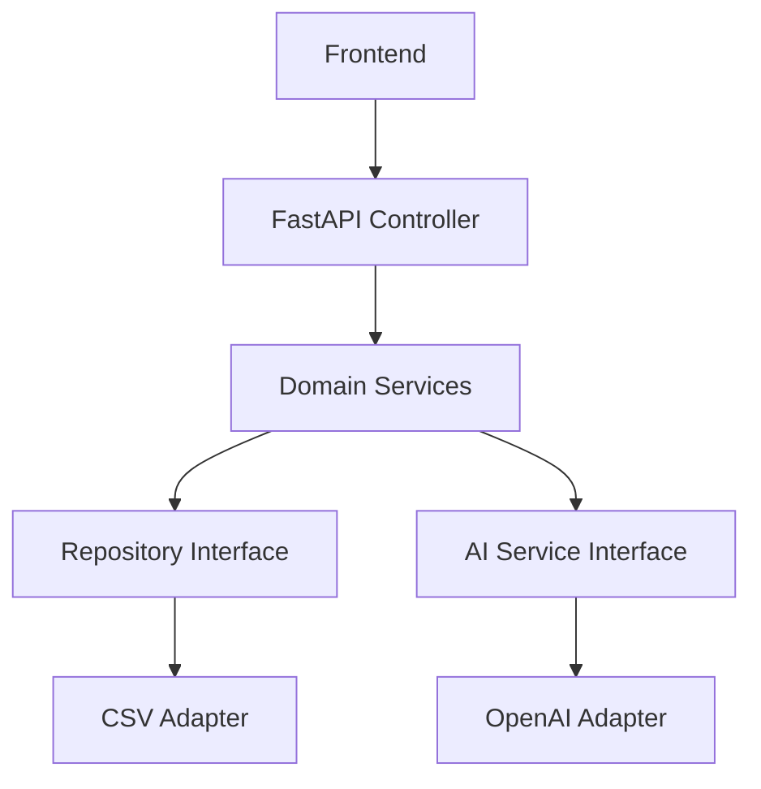

# 🤝 Guía de Contribución - Puerto de Chancay

¡Gracias por tu interés en contribuir al proyecto **Puerto de Chancay - Sistema de Gestión Inteligente**!

Esta guía te ayudará a participar de manera efectiva en el desarrollo y mejora de este sistema de demostración de **Arquitectura Hexagonal + IA**.

## 📋 Tabla de Contenidos

- [🎯 Filosofía del Proyecto](#filosofía-del-proyecto)
- [🚀 Empezando](#empezando)
- [🔧 Configuración del Entorno](#configuración-del-entorno)
- [📁 Estructura del Código](#estructura-del-código)
- [💡 Tipos de Contribución](#tipos-de-contribución)
- [🧪 Proceso de Testing](#proceso-de-testing)
- [📖 Documentación](#documentación)
- [🔄 Flujo de Trabajo Git](#flujo-de-trabajo-git)
- [✅ Checklist de Pull Request](#checklist-de-pull-request)
- [❓ Preguntas Frecuentes](#preguntas-frecuentes)

## 🎯 Filosofía del Proyecto

### Principios Fundamentales

1. **Clean Architecture First** - Mantenemos la separación de responsabilidades
2. **Educational Value** - El código debe ser didáctico y bien documentado
3. **Production Quality** - Aunque es demo, aplicamos estándares profesionales
4. **AI Integration** - Exploramos nuevas formas de integrar IA de manera práctica

### Objetivos del Sistema

- **Demostrar** Arquitectura Hexagonal en un caso real
- **Integrar** OpenAI de manera elegante y útil
- **Simular** operaciones portuarias del futuro
- **Inspirar** a desarrolladores con buenas prácticas

## 🚀 Empezando

### Prerrequisitos

- **Python 3.11+**
- **Git** configurado
- **OpenAI API Key** (para testing local)
- **Editor** con soporte para Python (VS Code recomendado)

### Fork y Clone

```bash
# 1. Fork en GitHub (botón Fork)
# 2. Clone tu fork
git clone https://github.com/tu-usuario/puerto-chancay-hexagonal-ai.git
cd puerto-chancay-hexagonal-ai

# 3. Agrega el repositorio original como upstream
git remote add upstream https://github.com/original-repo/puerto-chancay-hexagonal-ai.git
```

## 🔧 Configuración del Entorno

### Entorno Virtual

```bash
# Conda (recomendado)
conda create -n chancay_dev python=3.11
conda activate chancay_dev

# O con venv
python -m venv venv
source venv/bin/activate  # Linux/Mac
# venv\Scripts\activate   # Windows
```

### Dependencias

```bash
# Dependencias principales
pip install -r requirements.txt

# Dependencias de desarrollo (opcional)
pip install pytest black flake8 mypy
```

### Variables de Entorno

```bash
# Crea archivo .env
OPENAI_API_KEY=tu-api-key-para-testing
ENVIRONMENT=development
DEBUG=true
```

## 📁 Estructura del Código

### Arquitectura Hexagonal

```
📁 domain/              # 💎 NÚCLEO - Sin dependencias externas
├── entities.py         # Entidades de negocio
├── ports.py           # Interfaces (contratos)
└── services.py        # Lógica de dominio

📁 adapters/           # 🔌 IMPLEMENTACIONES - Intercambiables
├── data_adapter.py    # Persistencia de datos
└── openai_adapter.py  # Servicios de IA

📁 api/                # 🌐 INTERFAZ - Exposición HTTP
└── controller.py      # Endpoints REST

📁 templates/          # 🎨 PRESENTACIÓN - UI/UX
├── landing.html       # Página de presentación
└── index.html         # Dashboard principal
```

### Reglas de Dependencia

```
api/         →    domain/    ✅ Permitido
adapters/    →    domain/    ✅ Permitido
domain/      →    adapters/  ❌ PROHIBIDO
domain/      →    api/       ❌ PROHIBIDO
```

## 💡 Tipos de Contribución

### 🐛 Bug Fixes

**Proceso:**
1. Reproducir el bug localmente
2. Crear issue describiendo el problema
3. Implementar fix siguiendo arquitectura
4. Agregar test que verifique la corrección
5. Actualizar documentación si es necesario

**Ejemplo de Issue:**
```markdown
**Bug:** Error 500 al cargar insights de IA

**Pasos para reproducir:**
1. Ir a dashboard
2. Hacer clic en "Ver Insights"
3. Error aparece en consola

**Comportamiento esperado:** Mostrar insights generados

**Entorno:** Python 3.11, OpenAI API activa
```

### ✨ Nuevas Features

**Ideas Bienvenidas:**
- **Nuevos adaptadores** (PostgreSQL, MongoDB, Redis)
- **Algoritmos de IA** personalizados
- **Métricas avanzadas** del puerto
- **Integración con APIs** externas
- **Nuevas visualizaciones** en el dashboard

**Proceso:**
1. Discutir idea en Issues
2. Diseñar según principios hexagonales
3. Implementar con tests
4. Documentar uso y beneficios
5. Demo en PR

### 🎨 Mejoras de UI/UX

**Áreas de Mejora:**
- **Responsive design** avanzado
- **Animaciones** y transiciones
- **Accesibilidad** (ARIA, contraste)
- **Componentes** reutilizables
- **Dark mode** toggle

### 📚 Documentación

**Tipos:**
- **README** improvements
- **Code comments** en español/inglés
- **API documentation**
- **Architecture diagrams**
- **Tutorials** paso a paso

## 🧪 Proceso de Testing

### Testing Local

```bash
# Ejecutar sistema completo
uvicorn app:app --reload

# Verificar endpoints
curl http://localhost:5000/api/overview
curl http://localhost:5000/api/ai-insights

# Testing manual UI
# → http://localhost:5000/landing
# → http://localhost:5000/
```

### Testing de Arquitectura

**Verificar que:**
- Domain no depende de adapters ✅
- Adapters implementan interfaces correctamente ✅
- Servicios pueden usar mocks fácilmente ✅
- Nuevos adapters se integran sin modificar domain ✅

### Testing de IA

```python
# Ejemplo de test para OpenAI adapter
def test_openai_adapter_mock():
    # Given
    mock_service = MockAIService()
    port_service = PortOperationService(ai_service=mock_service)

    # When
    insights = port_service.generate_insights()

    # Then
    assert len(insights) > 0
    assert insights[0].confidence > 0.5
```

## 📖 Documentación

### Code Comments

```python
# ✅ Bueno - Explica el "por qué"
class PortOperationService:
    """
    Servicio principal de operaciones portuarias.

    Implementa la lógica de negocio siguiendo Domain-Driven Design.
    Independiente de infraestructura para facilitar testing.
    """

    def optimize_crane_assignment(self, containers: List[Container]) -> Dict:
        """
        Optimiza asignación de grúas basado en prioridad y tipo de carga.

        Args:
            containers: Lista de contenedores en espera

        Returns:
            Dict con asignaciones optimizadas por grúa

        Business Rules:
            - Contenedores peligrosos tienen prioridad máxima
            - Perecederos procesados antes de 4 horas
            - Balanceo de carga entre grúas disponibles
        """
```

### Diagramas

Usar **Mermaid** para diagramas en markdown:



## 🔄 Flujo de Trabajo Git

### Branches

```bash
# Feature branch
git checkout -b feature/crane-optimization

# Bug fix branch
git checkout -b bugfix/ai-insights-error

# Documentation branch
git checkout -b docs/architecture-guide
```

### Commits

**Formato:**
```
<tipo>(<scope>): <descripción>

[cuerpo opcional]

[footer opcional]
```

**Ejemplos:**
```bash
feat(domain): agregar optimización de grúas

Implementa algoritmo de asignación inteligente considerando:
- Prioridad por tipo de carga
- Balanceo de recursos
- Restricciones de tiempo

Closes #15

fix(adapters): corregir error de parsing en OpenAI response

El response no incluía confidence score en algunos casos.
Agregado fallback a 0.5 cuando falta el campo.

docs(readme): actualizar instrucciones de instalación

Agregadas secciones sobre:
- Configuración de entorno conda
- Variables de entorno
- Troubleshooting común
```

### Sincronización

```bash
# Antes de crear PR
git fetch upstream
git rebase upstream/main
git push origin feature/mi-feature
```

## ✅ Checklist de Pull Request

### Antes de Enviar

- [ ] **Funcionalidad** probada localmente
- [ ] **Arquitectura hexagonal** respetada
- [ ] **Sin dependencias circulares** en domain/
- [ ] **Código comentado** en español
- [ ] **README actualizado** si es necesario
- [ ] **No hay console.log** o prints de debug
- [ ] **API key no expuesta** en commits

### Descripción del PR

```markdown
## 🚀 Descripción

Breve descripción de los cambios realizados.

## 🔧 Cambios Técnicos

- [ ] Domain: [descripción]
- [ ] Adapters: [descripción]
- [ ] API: [descripción]
- [ ] Frontend: [descripción]

## 🧪 Testing

- [ ] Testing manual realizado
- [ ] Casos edge considerados
- [ ] Performance verificado

## 📸 Screenshots

[Si aplica, capturas de pantalla]

## ✨ Demo

[Link o instrucciones para probar la feature]
```

## ❓ Preguntas Frecuentes

### **Q: ¿Puedo cambiar la estructura de carpetas?**

**A:** La estructura sigue principios de Arquitectura Hexagonal. Cambios deben discutirse en Issues para mantener propósito educativo.

### **Q: ¿Puedo usar otras librerías de IA?**

**A:** ¡Sí! Crea un nuevo adapter (ej: `claude_adapter.py`) implementando la interfaz `AIService`. Esto demuestra intercambiabilidad.

### **Q: ¿Cómo agrego un nuevo tipo de contenedor?**

**A:**
1. Actualiza `Container` entity en `domain/entities.py`
2. Modifica servicios en `domain/services.py`
3. Actualiza adapter de datos si es necesario
4. Frontend puede requerir cambios visuales

### **Q: ¿Puedo usar bases de datos reales?**

**A:** Perfecto! Crea `postgresql_adapter.py` o `mongodb_adapter.py` implementando `DataRepository`. El domain no cambia.

### **Q: ¿El proyecto acepta contribuciones en inglés?**

**A:** Comments y documentación preferimos en español (propósito educativo). Código y nombres de variables pueden ser en inglés.

---

## 💪 ¡Empezar a Contribuir!

1. **Explora** el código y entiende la arquitectura
2. **Ejecuta** el sistema localmente
3. **Busca** issues con label `good-first-issue`
4. **Haz preguntas** si algo no está claro
5. **Comparte** tus ideas y mejoras

---

<div align="center">
  <h3>🚢 ¡Juntos construyamos el futuro de la gestión portuaria!</h3>
  <p><em>Cada contribución hace que este proyecto sea más valioso para la comunidad</em></p>
</div>
